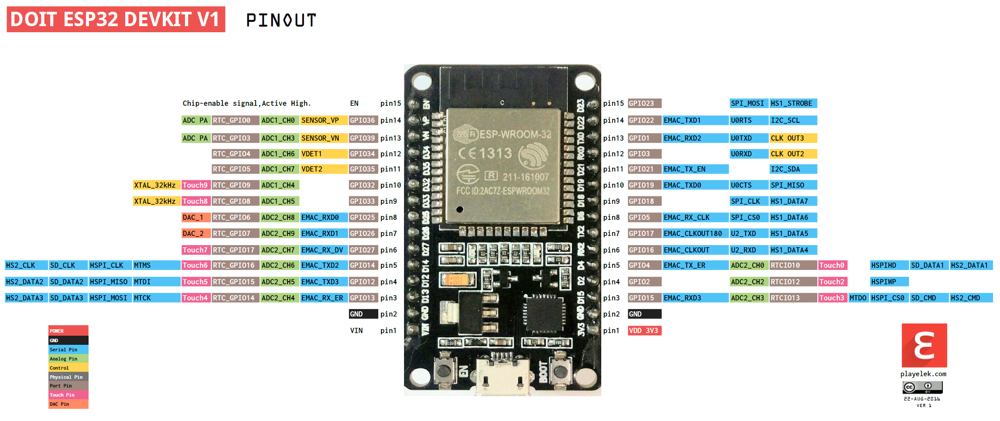
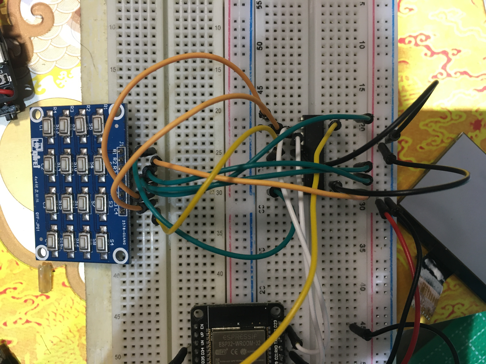

# Lorim Pinouts

-----

### Configure MCU pin functions [here](../Lorim_definitions.hpp#L30).
<!-- Should point to line that says '// esp32' -->

-----

## Keyboard scanner CH450 (I2C)
*Will this work as an IO expander?* **No.** 

Keyboard is wired to CH450 in this way.

- D21 - SDA
- D22 - SCL
- D34 - Interrupt

-----

## Display LX-12864L-1 (VSPI)
| Arduino | Description                 | Display |
|---------|-----------------------------|---------|
| D18     | SCL                         | 4       |
| D19     | D/C (MISO)                  | 3       |
| D23     | SDA (MOSI)                  | 5       |
| D5      | CS                          | 1       |
| RST     | EN (Hardware reset button)  | 2       |

-----

## LoRa Module SX1278 (HSPI)
- [SX1276/77/78/79 Datasheet by Semtech (English)](./Assets/DS_SX1276-7-8-9_W_APP_V7.pdf)
- [SX1278ZTR4-GC Module Datasheet by Silicontra (Simplified Chinese)](./Assets/SX1278ZTR4-lora.pdf)

| Arduino | Description  | Module |
|---------|--------------|--------|
| D12     | MISO         | MISO   |
| D13     | MOSI         | MOSI   |
| D14     | CLK          | CLK    |
| D15     | CS           | SEL    |
| D36     | Module RST   | RST    |
| D39     | Module DIO0  | DIO0   |

-----

## Reserved pins
Reserved section. ;)

-----

## Keycodes
- facing display

|    |    |    |    |
|----|----|----|----|
| 13 |  3 |  2 |  1 |
| 14 |  6 |  5 |  4 |
| 15 |  9 |  8 |  7 |
| 16 | 12 | 11 | 10 |

- facing keyboard

|    |    |    |    |
|----|----|----|----|
|  1 |  2 |  3 | 13 |
|  4 |  5 |  6 | 14 |
|  7 |  8 |  9 | 15 |
| 10 | 11 | 12 | 16 |

-----

# Lorim file system structure
LittleFS 
&emsp;│ 
&emsp;├ history.txt 
&emsp;| 
&emsp;├ `<Pending>` 
&emsp;| 
&emsp;└ `<Pending>`
