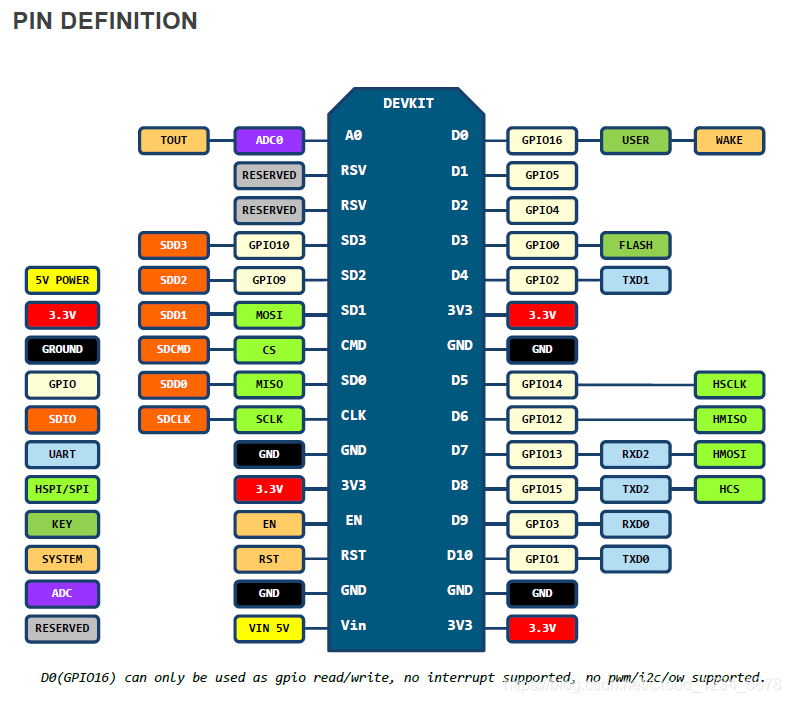

# Lorim Pinouts

## *THIS IS A PLACEHOLDER FILE AND IS SUBJECT TO CHANGE AT ANY TIME*

-----

## Keyboard scanner CH450 (I2C)
*Will this work as an IO expander?* 
- D21 - SDA
- D22 - SCL
- D34 - Interrupt

-----

## Display LX-12864L-1 (VSPI)
| Arduino | Description                 | Display |
|---------|-----------------------------|---------|
| D18     | SCL                         | 4       |
| D19     | D/C (MISO)                  | 3       |
| D23     | SDA (MOSI)                  | 5       |
| D5      | CS                          | 1       |
| RST     | EN (Hardware reset button)  | 2       |

-----

## SX1278 (HSPI)
| Arduino | Description  | Module |
|---------|--------------|--------|
| D12     | MISO         | MISO   |
| D13     | MOSI         | MOSI   |
| D14     | CLK          | CLK    |
| D15     | CS           | SEL    |
| D36     | Module RST   | RST    |
| D39     | Module DIO0  | DIO0   |

-----

##  Reserved pins
Nothing.

-----

# Lorim file system structure
LittleFS 
&emsp;│ 
&emsp;├ history.txt 
&emsp;| 
&emsp;├ `<Pending>` 
&emsp;| 
&emsp;└ `<Pending>`
