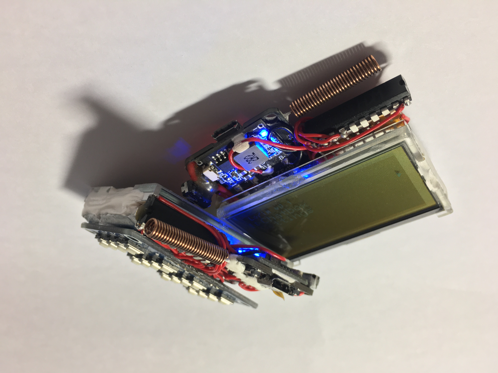
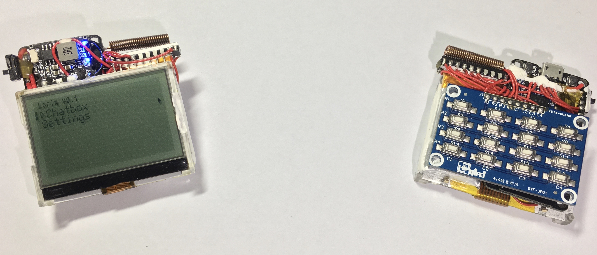
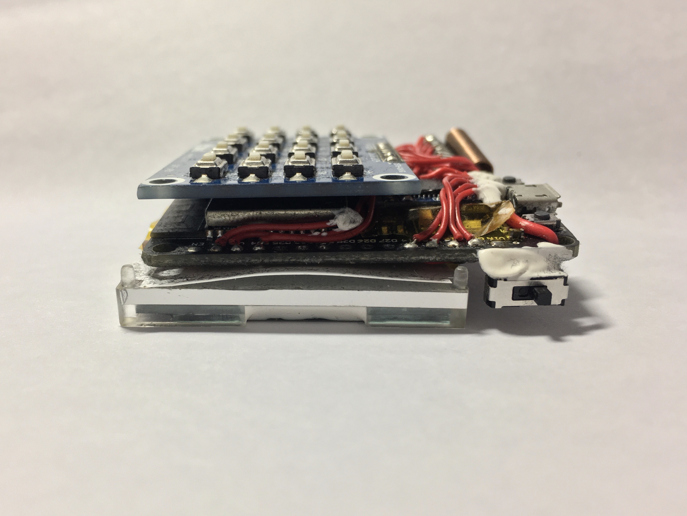
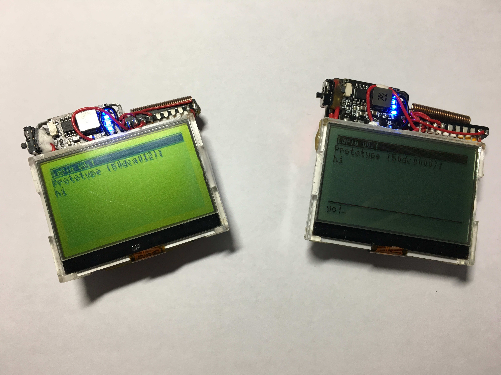

**English | [简体中文](./README.zh-CN.md)**

## What is this?
Lorim is an open-source handheld messaging device based on LoRa technology, powered by ESP32.

Photos of the two devices I put together

- [Features & Demonstration](./Demo.md)

For developers

- [Wiring and pinouts](./Pinouts.md)

- [Code documentation](./CodeDocs.md)

## Progress
I'm going to call it done. Lacks the ability to PM, customize and save username, etc.

There are better instant messengers out there, but I haven't seen an open-source one that's good, which is the motivation of this *(crap)* project.

Remind me if you see one out in the wild. ;) 
*(Yeah I know about [disaster.radio](https://github.com/sudomesh/disaster-radio)... that is not for casual use tho, and its maintenance has halted.)*

## References
- ESP32 universal file uploader: <https://github.com/lorol/arduino-esp32fs-plugin> 
- LittleFS documentation: <https://arduino-esp8266.readthedocs.io/en/latest/filesystem.html> 
- LoRaLayer2: <https://github.com/sudomesh/LoRaLayer2> 
- GEM: <https://github.com/spirik/GEM>

<!--
    Odd checksum
        68ef2aae8c056a156436a91964b14c91
-->
